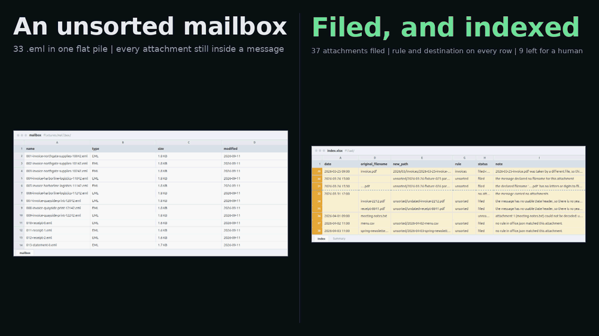

# inbox-filer — a mailbox of attachments, filed and indexed

Point it at a mailbox. It files every attachment into named folders and writes
an index sheet listing what went where and why.



The rules live in one small JSON file you can read in a minute. No model, no
training, no "it learns your filing over time". If you want to know where next
Tuesday's invoice will end up, you read six lines of `rules/office.json` and you
know. That is the whole design: a filing system nobody can predict is one nobody
trusts, and one nobody trusts gets used once.

```
$ make plan     # show me everything you would do, and touch nothing
$ make run      # do it
```

Run it twice and nothing duplicates, nothing is overwritten, and the index sheet
comes out byte-for-byte identical. That is not a claim in a README, it is
`tests/test_cli.py::test_the_index_is_byte_identical_on_the_second_run`.

---

## Install and run

You need `make`, `curl` and a C library. Not Python — it will fetch one.

```
git clone <url> inbox-filer
cd inbox-filer
make plan       # the dry run: prints the full plan, writes nothing
make run        # files the bundled sample mailbox
```

From a dead clone to real output is **about 6 seconds**, measured on a machine
with no `uv`, no `ensurepip` and an empty `HOME`. The first target you run
fetches a pinned `uv` into `demo/.toolchain/`, which then supplies a Python 3.12
if the machine has none. Nothing is installed outside the checkout and nothing needs
root.

If you would rather drive it yourself:

```
uv venv --python 3.12 && uv pip install -e '.[dev]'
.venv/bin/python file_mail.py fixtures/mailbox --dry-run
.venv/bin/python file_mail.py fixtures/mailbox --report
```

The one runtime dependency is `openpyxl`, which writes the `.xlsx` half of the
index. Everything else is the standard library — `email`, `csv`, `hashlib`,
`zipfile`. The `.csv` half of the index needs nothing at all, so a machine that
cannot install openpyxl still gets a usable index.

---

## Where things go

```
filed/
├── 2026/
│   ├── 02/
│   │   ├── bank-statements/ — 2 files
│   │   └── invoices/ — 1 file
│   ├── 03/
│   │   ├── contracts/ — 1 file
│   │   ├── invoices/ — 13 files
│   │   ├── photos/
│   │   │   └── crew/ — 8 files
│   │   └── suppliers/
│   │       └── northgate-supplies-example/ — 1 file
│   └── 04/
│       └── receipts/ — 3 files
├── unsorted/ — 6 files
├── index.csv
└── index.xlsx
```

The shape is `<year>/<month>/<folder>/<filename>`, where `<folder>` comes from
the rule that matched and `<filename>` is built from the message date and the
attachment's own name:

```
2026/03/invoices/2026-03-03-invoice-10042.pdf
└┬─┘ └┬┘ └───┬──┘ └───┬────┘ └──────┬───────┘
year  mo   folder    date        the attachment was called
                                 "invoice-10042.pdf"
```

Both halves are templates in the rule file, so if your client files by quarter,
or by sender first, that is a one-line change and not a fork.

---

## The rule file

`rules/office.json`, in full-ish:

```json
{
  "path_template": "{year}/{month}/{folder}/{filename}",
  "filename_template": "{date}-{slug}{ext}",
  "unsorted_folder": "unsorted",

  "rules": [
    { "name": "invoices",
      "folder": "invoices",
      "when": { "subject_matches": "(?i)\\b(invoice|inv)\\b" } },

    { "name": "bank-statements",
      "folder": "bank-statements",
      "when": { "sender_domain": "northbank.example" } },

    { "name": "site-photos",
      "folder": "photos/{sender_local}",
      "when": { "extension_is": [".jpg", ".jpeg", ".png"] } }
  ]
}
```

**Rules are read top to bottom and the first one whose conditions *all* hold
wins.** Nothing below it is consulted. That is why `invoices` sits above
`bank-statements`: an invoice from the bank is an invoice, and the order in the
file is how you say so. Swapping those two lines swaps the behaviour, which is
the point.

### Conditions

All conditions inside one `when` must hold. There are six, and the list is
closed — a condition name that is not one of these is an error when the file
loads, not a rule that silently matches everything.

| condition | matches when |
|---|---|
| `sender_is` | the sender's address equals this exactly (case-insensitive) |
| `sender_domain` | the part after the `@` equals this |
| `sender_matches` | this regex is found in the sender's address |
| `subject_matches` | this regex is found in the subject |
| `filename_matches` | this regex is found in the attachment's declared filename |
| `extension_is` | the declared filename ends with one of these, e.g. `[".jpg", ".png"]` |

`filename_matches` is worth knowing about: the covering email usually says
nothing useful ("As discussed"), while the attachment is called
`Bellweather-NDA-signed.pdf`. Match the thing that carries the information.

### Placeholders

| in | you can use |
|---|---|
| `folder` | `{sender_domain}` `{sender_local}` `{sender_slug}` `{rule}` |
| `filename_template` | `{date}` `{slug}` `{ext}` `{sender_slug}` `{sender_domain}` `{rule}` |
| `path_template` | `{year}` `{month}` `{folder}` `{filename}` |

`{slug}` is the attachment's own name, lowercased, with runs of punctuation
collapsed to hyphens and accents folded rather than dropped — `Rechnung-März`
becomes `rechnung-marz`, not `rechnung-mrz`. Dropping the letter would make two
different names collide, and a collision is exactly what the naming scheme
exists to avoid inventing.

### Everything that can be wrong with the file is reported when it loads

Not on message four hundred, halfway through a filing run:

```
$ python file_mail.py mail/ --rules broken.json
file_mail.py: rule 2 (statements): when: unknown key 'sender_contains'.
Known: sender_is, sender_domain, sender_matches, subject_matches,
filename_matches, extension_is
```

A rule with no conditions, a regex that will not compile, a folder containing
`..`, a duplicate rule name, a `filename_template` with no `{slug}` in it, a
placeholder that does not exist — each is refused by name, and nothing is
written. There is no half-filed cabinet.

---

## What it refuses to guess

An attachment the rules cannot place goes to `unsorted/` and the index records
why. It is never dropped, never renamed into a plausible-looking folder, and
never filed under a date somebody made up.

There are four reasons an attachment lands there, and they are the four things
that go wrong with real mail:

**No rule matched.** The honest one. `no rule in office.json matched this
attachment`. Six rules cannot cover a mailbox and pretending otherwise just
moves the mistake somewhere harder to find.

**The declared filename is unusable.** Either the message named no file at all,
or the name has nothing in it to file under (`….pdf` slugifies to nothing). It
still gets written, under a name derived from the message's own ID —
`unsorted/2026-03-26-fixture-025-part1.pdf` — and the index keeps the original
string in the `original_filename` column next to the reason. Derived from the
message, not invented.

**There is no usable date.** The `Date` header is missing, or it is present and
says `Sometime last Tuesday`. Either way there is no year or month to file
under. These two are reported differently, because they are different problems:
one is a mail client, the other is a specific sender producing specific rubbish,
and you can only chase the second if the tool hands back what was actually in
the header. (The Python standard library renders an unparseable `Date` as the
empty string, which makes it look identical to a missing one. `mailbox._date`
goes around that.)

**A filename carrying a path.** `../../../etc/passwd-notes.txt` is either a
broken mail client or somebody trying it on. Either reading gives the same
answer: a message declares a *name*, not a location. Everything before the last
slash is discarded and the rest files normally.

### And one thing that does not get filed at all

An attachment that will not decode — a text part declaring a charset that does
not exist, say — gets a row in the index saying so and no file. A zero-byte PDF
sitting in the client's invoice folder is a worse outcome than a line explaining
why there is no PDF. It is logged, it is not dropped, and it is not written as
an empty file.

---

## Running it twice

The tool identifies an attachment by the sha256 of its bytes. A destination
holding those exact bytes *is* that attachment, already filed:

- **Same file, already there** → nothing happens. Not rewritten, not copied.
- **Different file wanting the same name** → the second gets `-2`, then `-3`,
  deterministically, and the index records which name it wanted and what it got.
- **A file you deleted** → put back on the next run. Filing again repairs the
  cabinet.
- **A file you edited** → left alone, and the original lands beside it as `-2`.
  Your edit is not something the tool gets to overwrite.

Because of that, a second run over an unchanged mailbox writes nothing:

```
$ make run >/dev/null && python file_mail.py fixtures/mailbox --brief --quiet
33 messages, 35 attachments
wrote 0 (1 renamed around a collision)
already filed, untouched 35
unsorted 6, unreadable 1, no attachment 1
index filed/index.csv
```

### The index sheet is reproducible too

This took a little work and is worth explaining, because it is the difference
between "trust me" and `cmp`.

The status column records **where an attachment ended up**, never what a
particular run had to do to get it there. So the sheet describes the filing
cabinet, and describing the same cabinet twice gives the same answer. "How many
files did this run write" is a fact about the run, and it is printed on stdout
where per-run numbers belong.

That leaves two clocks. An `.xlsx` is a zip, and zip members are stamped with
the time they were written; it is also an Office document, and openpyxl
refreshes `docProps/core.xml`'s modification timestamp as it saves. Both are
flattened to a fixed epoch (`index._repack`), so:

```
$ make run && cp filed/index.xlsx /tmp/before.xlsx && make run
$ cmp /tmp/before.xlsx filed/index.xlsx && echo identical
identical
```

---

## The dry run

`--dry-run` prints every destination it would use, every collision suffix, every
reason something is going to `unsorted/`, and then **re-reads the output
directory and reports what is actually in it**:

```
  would file                  2026/03/invoices/2026-03-03-invoice-10042.pdf
  would file (renamed)        2026/03/invoices/2026-03-25-invoice-2.pdf
                                why: 2026-03-25-invoice.pdf was taken by a different file, so this one is 2026-03-25-invoice-2.pdf
  cannot read                 (031-broken-charset.eml)
                                why: attachment 1 (meeting-notes.txt) could not be decoded: unknown encoding: x-unknown-9000
  would file                  unsorted/undated-invoice-2212.pdf
                                why: the message has no usable Date header, so there is no year or month to file it under

35 attachments: 29 filed by a rule, 6 sent to unsorted/, 1 renamed around a collision.
35 to write, 0 already filed and left alone.
Plus 1 attachment that would not decode, and 1 message with nothing attached.

by rule:
  invoices                 14
  site-photos               8
  ...
  unsorted                  6

Nothing was written: filed/ does not exist. Re-read after planning, not assumed.
```

That last line is a measurement, not a promise. The output directory's state is
captured before planning and again after, and if the two ever differ the tool
prints `SOMETHING WAS WRITTEN DURING A DRY RUN` and exits 5. There is a test
that forces a write mid-plan purely to prove that branch fires, because a safety
check nobody has ever seen fail is a safety check nobody should believe.

The dry run is trustworthy for a structural reason as well: it is not a separate
code path. `plan.py` decides everything and touches nothing; `apply.py` writes
what it was told and decides nothing. `--dry-run` is the ordinary run with the
second half not called.

The plan sorts ordinary filings first and everything needing a human last, so
the end of a long listing is the part worth reading.

---

## Pointing it at a real mailbox

The bundled mailbox is **synthetic** — see below — but that is a property of
this demo, not a limit of the tool. It reads:

- a directory of `.eml` files (what most people hand you when you ask for "some
  emails"), or
- a **Maildir** with `cur/` and `new/`, which is what `offlineimap`, `mbsync`
  and friends produce.

So the realistic path to a live mailbox today is to sync it down with `mbsync`
and point this at the result, which is also the arrangement you want for a
scheduled job: one tool does the network, another does the filing, and the
filing one is runnable offline against a directory you can inspect.

Reading IMAP directly is a change to `mailbox.py` and nothing else — everything
downstream takes `Message` objects, and `imaplib` is in the standard library.
It is not done here because credentials in a portfolio demo are a liability, and
because a fixture mailbox is the only way to have the awkward cases on hand
every time.

To use your own rules:

```
python file_mail.py ~/Maildir --rules rules/mine.json --out ~/Filing
```

For a scheduled job:

```
python file_mail.py ~/Maildir --brief --quiet --fail-on-unsorted
```

`--brief` is five lines, which is what a cron log wants. `--fail-on-unsorted`
exits 1 when something reached `unsorted/`, so your monitoring tells you the
rules need a look rather than silently accumulating a pile nobody opens.

---

## The index sheet

`filed/index.csv` and `filed/index.xlsx`, one row per attachment — plus a row
for every message that had none, so the sheet accounts for the mailbox rather
than just for the files that came out of it.

| column | |
|---|---|
| `date` | the message's date, `YYYY-MM-DD HH:MM`, blank if unreadable |
| `sender` | `Name <address>` as sent |
| `subject` | decoded, so no `=?utf-8?B?...?=` |
| `original_filename` | what the message called it, verbatim, awkward or not |
| `new_path` | where it went, relative to `--out`. Blank if nothing was written |
| `size_bytes` | a real number in the XLSX, so sorting by it works |
| `rule` | the rule that matched, or `unsorted` |
| `status` | `filed`, `filed-renamed`, `no-attachment`, `unreadable-attachment` |
| `note` | why, in a sentence, for anything that is not the boring case |
| `source_message` | the message file, so a row leads back to the email |

The XLSX has a second `Summary` sheet with the counts, a frozen header row, an
autofilter, and colour on the rows that need a look.

---

## Sample data

Everything under `fixtures/` is invented. Senders are all under `.example`,
which RFC 2606 reserves and which can never be a live domain. The attachments
are generated byte by byte — real PDFs, real PNGs, real zips — rather than
copied from anywhere.

`fixtures/generate_mailbox.py` writes the mailbox **and** `tests/expected.json`
from the same values, so the tests assert against what was sent rather than
against what the reader happens to produce. That is not ceremony: it is what
caught the fixture bug described at the bottom of this file.

33 messages, 36 declared attachments, chosen so the awkward cases are always in
front of you:

| | |
|---|---|
| 24 ordinary messages | invoices, receipts, statements, photos, a contract |
| 1 | an invoice from the bank — matches two rules, and rule order decides |
| 1 | non-ASCII sender, subject and filename |
| 2 | the same filename on the same day from the same sender, different contents |
| 2 | unusable filenames: one declared none, one is pure punctuation |
| 1 | a filename carrying `../../../etc/` |
| 1 | no `Date` header |
| 1 | a `Date` header reading `Sometime last Tuesday` |
| 1 | an attachment declaring a charset that does not exist |
| 1 | no attachment at all |
| 2 | nothing in the rules matches them |

Regenerate with `make fixtures`. It is deterministic down to the multipart
boundaries, so regenerating is a no-op in git unless the generator changed.

---

## Options

```
python file_mail.py MAILBOX [options]

  --rules FILE          rule file (default: rules/office.json)
  --out DIR             where the filing cabinet lives (default: filed)
  --dry-run             print the whole plan, write nothing, then prove it
  --report              the full summary
  --brief               five lines, for a cron log
  --quiet               suppress progress chatter
  --fail-on-unsorted    exit 1 if anything needs a look
```

Exit codes:

| | |
|---|---|
| 0 | filed |
| 1 | something reached `unsorted/` or would not decode (with `--fail-on-unsorted`) |
| 3 | the rule file or the arguments are wrong. Nothing was written |
| 4 | the mailbox could not be read |
| 5 | a bug in this tool: a dry run touched the disk, or a destination moved between planning and writing. Nothing was overwritten |

---

## Tests

```
make test
```

303 tests, about 14.5 seconds — 13.9, 14.5 and 14.8 s over three runs — and no
network. Two of them skip in a dead clone — the `ffprobe` cross-check in
`tests/test_readme_clip.py`, which needs a toolchain `make demo` downloads.
They are the suite's only skips and they are a
cross-check, not a guard. They cover the mailbox reader against the
generated ground truth, the rule loader's refusals one by one, collisions and
idempotency at the planner level, and the four acceptance behaviours end to end
(`tests/test_cli.py`): the dry run changing not one byte, the second run being a
no-op, the collision landing with a suffix, and the unparseable names landing in
`unsorted/` with reasons.

`tests/test_make_targets.py` drives `make` itself in a throwaway copy of the
repo. It exists because the piece before this one shipped a `demo/setup.sh` that
ran `rm -rf out` on every `make` target, so `make test` deleted what `make run`
had just written — two commands printed on adjacent lines in that README. Here
only `demo/record.sh` may ask for the wipe, with an explicit `--fresh`, and the
test asserts that it still does.

`tests/test_readme_clip.py` reads the clip-length sentence further down this
file back off the committed `demo/out/demo.gif` and `demo/out/demo.mp4`. It
parses the numbers out of README.md rather than restating them, so a re-record
that moves the clip and leaves the prose behind fails there. Its duration
readers are stdlib, because a dead clone has no `ffprobe`, and they are pinned
against hand-built mp4 and gif headers.

`tests/test_readme_counts.py` does the same to the test counts in this file —
all three copies of the total, and the skip figure, which it takes off the
ffprobe cross-check's own parametrised count rather than from a number typed
twice. It is here because that total had gone stale twice in two weeks, both
times in a commit that added tests: the number nobody can see is the number
nobody updates.

Verified on a clean machine, meaning `env -i` with an empty `HOME` and a PATH
holding no `uv`:

| | |
|---|---|
| dead clone → filed output (`make run`) | 6.2 s median (5.9, 6.1, 6.2, 6.6, 7.1 over five clones) |
| dead clone → `make test` (303 tests) | 20.9 s median (20.7, 20.9, 21.0 over three clones), of which 14.3 s is the suite |
| `make plan` / `make run`, venv warm | 0.4 s / 0.5 s |
| second `make run` | 0.5 s, tree byte-identical |
| `make demo`, toolchain warm | 22 to 23 s (21.8, 21.8, 22.0, 22.7, 23.0, 23.1 over six runs in two passes) |
| `.venv` | 118 MB |
| demo toolchain | 760 MB, of which 549 MB is the unpacked Chromium |

The failure path is driven deliberately too: with a `curl` shimmed to exit 7 and
no `ensurepip`, `setup.sh` retries, reports the real exit code, prints what to
install, and `make` exits non-zero having written nothing.

### Re-measuring that table

```bash
make timings          # measure it, and diff it against this file
make timings ARGS="--list"
```

Every figure in the table above is a wall clock or a disk size on one machine,
which is why none of them is asserted by the suite: doing that would buy a
flaky suite rather than a guard. They get `tools/timings.py` instead — run by
hand before a push, never in CI. It re-measures each row (fresh clones under
`env -i` for the dead-clone ones, the toolchain-warm re-record into a scratch
directory so the committed clip cannot move), prints the line of this README
that states it, and says whether the two still agree. It exits non-zero when
they do not, so `make` reports `Error 1`; that is the verdict arriving, not a
crash.

---

## Recording the demo

```
make demo
```

Rebuilds `demo/out/demo.gif` and `demo/out/demo.mp4` — two encodes of one
capture — headless from nothing, fetching uv, Playwright, a headless Chromium
and ffmpeg into `demo/.toolchain/`. Measured on this machine: **22 to 23
seconds** to re-record once that toolchain is there (21.8, 21.8, 22.0, 22.7,
23.0 and 23.1 over six runs in two passes); the first run adds the Chromium
download on top, which I have not timed — it lands as 549 MB of the 760 MB
toolchain, but the download wall clock is not a number I can give you.

The clip is 18 s against a 35 s budget that `record.sh` enforces by reading the
encoded file, so the guard is real rather than a note about not shipping a
two-minute GIF. That sentence is itself checked:
`tests/test_readme_clip.py` parses the two numbers out of this file and reads
the duration back off the committed `demo/out/demo.gif` and `demo/out/demo.mp4`,
so a re-record that moves the clip and leaves the README behind fails the suite.

**The clip ends on the real file.** The scene runs `file_mail.py`, then opens
`filed/index.xlsx` — the sheet that run just wrote — and reads it off disk. It
is not a fixture and not a re-typed table; if the run does not write it, the
recording fails instead of showing you one.

`make demo-terminal` records the same story as a terminal session into
`demo/out-terminal/` instead.

`demo/lib/` is shared scaffolding carried across four portfolio pieces and is
not specific to this one — including `lib/sheet.py`, which draws every
spreadsheet frame in the portfolio. The files that are specific: `demo/recipe`,
`demo/setup.sh`, `demo/scene.py` and `demo/demo.tape`.

---

## Limits, honestly

- **No IMAP.** Sync with `mbsync` and point this at the Maildir. See above.
- **The whole mailbox is read into memory.** Fine for the tens of thousands of
  messages a small business has; not what you would run over a 40 GB archive
  without teaching the planner to stream.
- **Rule conditions are ANDed only.** No `or`, no `not`. Two rules do the job of
  an `or` and read better; `not` has no good answer yet and I would rather leave
  it out than guess at the syntax.
- **`--out` is a local directory.** No S3, no SharePoint, no network target.
- **Encrypted or signed messages** are read as the parts they are. An
  `application/pkcs7-mime` blob files as a blob; it is not decrypted.
- **The month folder is numeric** (`03`, not `March`). One line in
  `path_template` if you want otherwise, but sorting is why it is that way.

---

## Layout

```
file_mail.py              entry point
inbox_filer/
  mailbox.py              .eml and Maildir in, Message objects out. The only
                          file that would change for IMAP
  rules.py                loading, validating and matching the rule file
  naming.py               slugs, extensions, and the line between an awkward
                          filename and an unusable one
  plan.py                 every decision, touching nothing
  apply.py                writing, deciding nothing
  index.py                the CSV and the XLSX, both reproducible
  report.py               what the run prints
  cli.py                  arguments and exit codes
rules/office.json         the rules, meant to be read
fixtures/                 the synthetic mailbox and the script that writes it
tests/                    303 tests
demo/                     recording scaffolding, shared across pieces
```

---

## One thing I would do differently

The fixture for "a `Date` header that is not a date" did not work for most of
the time I was building this, and the tests passed anyway.

`email.policy.default` will not *serialise* a date it cannot parse — it writes
an empty `Date:` header instead. So the message I thought carried
`Sometime last Tuesday` actually carried nothing, the tool correctly reported
"no Date header", and my test asserting "unparseable, not missing" failed for a
reason that had nothing to do with the code under test. The fix was to splice
the bad header in as raw bytes, which is how a mail client emitting rubbish
would produce it in the first place.

The lesson is not about the `email` module. It is that a fixture generated
through the same library the tool uses to read it can only contain things that
library is willing to produce, and the interesting failures are exactly the ones
it is not. Next time I write a fixture for malformed input, the malformed part
gets written as bytes from the start.
